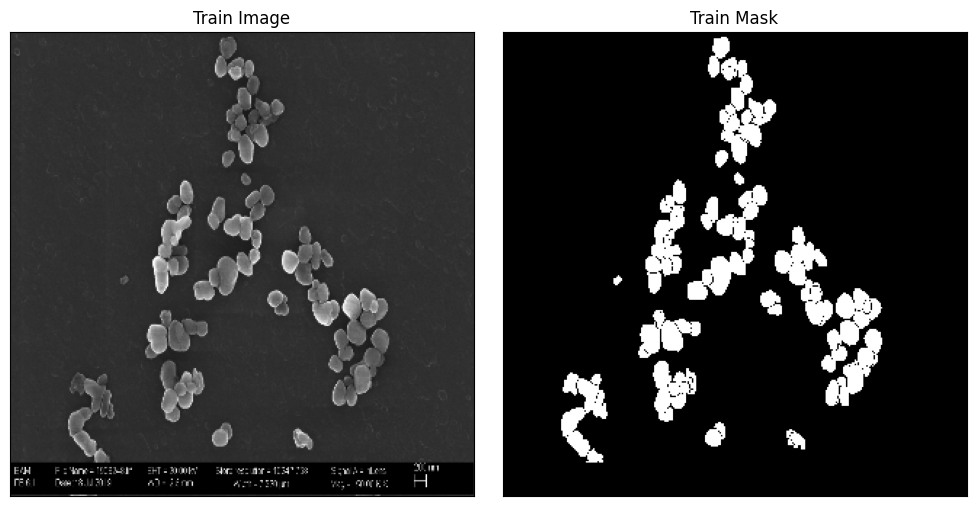
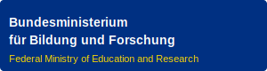

.. Machine Learning for Electrochemical Image Processing documentation master file

.. _index:

Machine Learning for Electrochemical Image Processing
======================================================

A hands-on tutorial on machine-learning-based image processing for
electrochemical and scientific microscopy data.

**Event:** DPG 2026, AKPIK Session — Dresden, March 2026

Developer
---------

**Amir Omidvarnia**
(`Forschungszentrum Jülich <https://www.fz-juelich.de>`_)

.. toctree::
   :maxdepth: 2
   :caption: Contents

   introduction
   image_processing_basics
   electrochemical_imaging
   preprocessing
   synthetic_data
   segmentation
   bibliography

Indices and tables
==================

* :ref:`genindex`
* :ref:`search`

Funding
=======

This work is funded by the German Federal Ministry of Education and Research
(Bundesministerium für Bildung und Forschung, **BMBF**).

